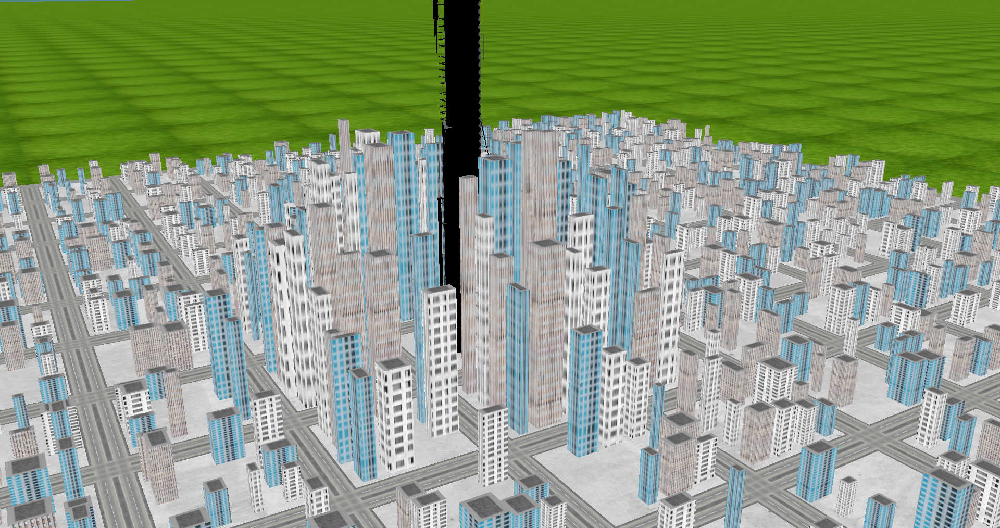

# City Final Assignment

## Ben Boyle 117501 - CS 4350 Fall 2021

I only claim ownership of the code in the `src` directory; all other code and assets belong to their respective authors.

## Building and Running

Build the project using CMake and **run the `city` executable from the repo root directory so that `data` is in PATH**; failure to do so will cause a crash on startup.

~~Occaisionally segfaults on initialisation; keep trying and it will start.~~ should be fixed as of [4c0b2fa](https://github.com/wavecommander/city/commit/4c0b2fa50d90bfbff66020dfd3ad9154d2ad2390)

## Controls

| Key(s) | Function                                                      |
|--------|:--------------------------------------------------------------|
| r      | generate new city and switch to it                            |
| space  | cycle through generated cities                                |
| wasd   | first person camera controls                                  |
| mouse  | look around with first person camera                          |
| scroll | change camera FOV                                             |
| shift  | 'sprint' (temporarily increase camera movement speed and FOV) |
| `      | toggle debug menus                                            |
| ctrl   | use camera while debug menus are open                         |

## Debug Menu

Things to try in the debug menu:

* Change the variables that dictate how the city grid is generated so when you press 'r' new cities will have those properties

* Select an individual building and change its dimensions and position

* Change the 'downtown' point so future cities will have its tallest buildings concentrated somewhere other than (0,0,0)

* Change the Citadel scale and animation function parameters
